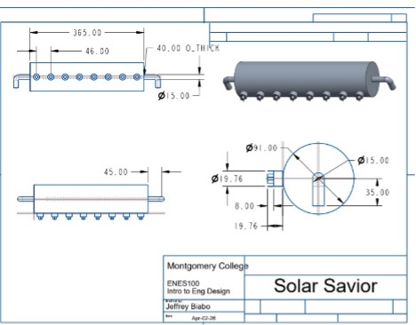

<p align="center">
  <h1 align="center">️ Solar Savior</h1>


## The Problem

Solar panel soiling,the accumulation of dust, pollen, bird droppings, and industrial pollutants on photovoltaic (PV) surfaces. It quietly is an expensive problem, Studies show it can reduce energy output by **25–30%** in high-debris areas, translating directly into lost revenue and degraded return on investment for solar owners.

For large utility-scale farms, industrial robotic cleaners exist. But for **residential homeowners**, **small-scale solar operators**, and **elderly or physically limited users**, the options are grim:

| Existing Solution | Why It Falls Short |
|---|---|
| Manual hosing | Excessive water waste, no debris tracking, inconsistent |
| Professional cleaning services | Expensive, fixed schedules unrelated to actual dirt buildup |
| DIY brush cleaning | Safety risk on rooftops, labor-intensive, sporadic |
| Basic automated cleaners | Rare in residential market, no performance feedback loop |

**None of these solutions give users data.** They clean on a schedule, not based on actual efficiency loss.

---

## The Solution

**Solar Savior** is a rail-mounted, screw-drive automated cleaning system designed specifically for residential and small-scale solar installations. It combines:

- A **mechanical cleaning arm** that travels along a precision screw-drive rail mounted directly on the panel frame
- An **Excel-based performance simulation** that models energy loss over time and calculates the optimal cleaning schedule
- A **VBA automation engine** that runs the simulation, triggers cleaning events, simulates rain, and updates all output charts in real time — entirely within Excel

> **⚠Engineering Constraint:** This project was intentionally restricted to two tools. **CREO Parametric** for mechanical design and **Microsoft Excel** for all simulation, analysis, and automation. No Python, MATLAB, or external simulation software was permitted. Every formula, loop, and chart was built from scratch within these constraints.

This constraint is what makes the project interesting. Building a dynamic, multi-variable physics simulation with a live dashboard inside Excel — using nothing but formulas and VBA — required learning the tools deeply and thinking creatively about what's possible within limits.

---


##  System Design

### Mechanical: Screw Drive Rail System (CREO Parametric)


*CREO Parametric technical drawing — screw drive rail assembly with dimension callouts*

The cleaning mechanism uses a **heavy-duty screw drive** rather than a belt-driven or cable-based system. This decision was deliberate and data-backed:

- **Belt systems** slip under outdoor moisture and variable tension — unreliable on inclined roof panels
- **Screw drives** convert rotational motor force into precise linear motion with no slippage, delivering consistent cleaning pressure regardless of panel inclination angle
- The rail mounts directly to the existing panel frame, requiring no roof penetration or structural modification
- Motor torque specifications were cross-validated against the weight of CREO-modeled components to ensure the system is not underpowered under load

### Mechanical Dimensions (from CREO Drawing)

| Component | Dimension |
|-----------|-----------|
| Rail total length | 365.00 mm |
| Rail inner offset | 46.00 mm |
| Roller outer diameter | Ø 15.00 mm |
| Roller wall thickness | 40.00 mm (O_THICK) |
| Screw shaft diameter | Ø 19.76 mm |
| Screw outer thread diameter | Ø 31.00 mm |
| Screw drive length | 35.00 mm |
| Frame width (short axis) | 45.00 mm |
| Screw thread pitch offset | 8.00 mm |

The screw assembly (right side of drawing) shows the cross-sectional profile of the threaded drive rod with spoke-style end cap, confirming the hollow-core construction that keeps the mechanism lightweight without sacrificing structural rigidity.

The full 3D model, component breakdown, and engineering drawings are documented in the technical report (`docs/Solar_Savior_Report.docx`).

---

## Simulation Model

The Excel simulation calculates photovoltaic performance across a configurable time window using five chained physics equations. All are implemented as Excel cell formulas and iterated via VBA.

### Equation 1 — Irradiance Model
```
I(t) = 1000 · sin( π(t − 6) / 12 )
```
Approximates solar intensity (W/m²) at any hour `t` of a standard daylight cycle. Peaks at solar noon (t = 12) with I = 1000 W/m², drops to zero at sunrise (t = 6) and sunset (t = 18).

### Equation 2 — Clean Power Output
```
P_clean = I × A × η
```
- `I` = irradiance at time t (W/m²)
- `A` = panel surface area (m²)
- `η` = panel conversion efficiency (decimal)

### Equation 3 — Dirty Panel Output
```
P_dirty = P_clean × (1 − D × L)
```
- `D` = current dirt accumulation level (0 = clean → 1 = fully soiled)
- `L` = maximum efficiency loss factor (e.g., 0.60 = up to 60% loss at full soiling)

Dirt accumulates incrementally each simulation day via the soiling rate parameter and is partially or fully reset by rain events and cleaning cycles.

### Equation 4 — Energy per Interval
```
E = P × Δt
```
Converts instantaneous power (W) to energy (Wh) for each 0.5-hour simulation step.

### Equation 5 — Financial Loss
```
C = (E_clean − E_dirty) × R
```
- `R` = local electricity rate ($/kWh)

Aggregated across all intervals to give total estimated dollar loss from soiling over the simulation period.

---

## Results

### Irradiance Profile (Standard Day)

| Time | Irradiance (W/m²) | Clean Power (W) | Dirty Power (W) |
|------|-------------------|-----------------|-----------------|
| 06:00 | 0 | 0 | 0 |
| 08:00 | 500 | 160 | 128 |
| 10:00 | 866 | 277.1 | 221.7 |
| **12:00** | **1000** | **320** | **256** |
| 14:00 | 866 | 277.1 | 221.7 |
| 16:00 | 500 | 160 | 128 |
| 18:00 | ~0 | ~0 | ~0 |

*Values computed at A = 1.6 m², η = 0.20, D = 1.0, L = 0.20*

### Multi-Day Simulation Results

| Scenario | Duration | Clean Every | Total Potential | Actual Output | Energy Lost | Financial Loss |
|---|---|---|---|---|---|---|
| A | 90 days | 20 days | 1,914.1 kWh | 1,048.4 kWh | 865.7 kWh | ~$45.45 |
| B | 40 days | 40 days | 911.5 kWh | 431.7 kWh | 479.8 kWh | ~$25.19 |

**Key takeaway:** Cleaning every 20 days on a 90-day window recovers significantly more energy than cleaning every 40 days, validating the need for a consistent, automated schedule rather than sporadic manual intervention.

### Optimal Cleaning Window

The simulation confirms that running the cleaning cycle **before 09:00 AM** yields the highest daily return — panels are clear before irradiance reaches the 700+ W/m² threshold that defines the high-output window (10:00–14:00).

---

##  Technical Skills Demonstrated

This project was an exercise in constraint-driven engineering — making the tools work harder than they were designed to:

- **CREO Parametric** — parametric 3D modeling, assembly constraints, torque/load analysis
- **Excel formula engineering** — chained multi-variable physics model built entirely in cells
- **VBA (Visual Basic for Applications)** — wrote custom automation: simulation loops, conditional event triggers (rain, cleaning), dynamic chart refresh, user input handling
- **Systems thinking** — cross-validated mechanical model specs (motor torque, rail load) against simulation outputs to ensure physical feasibility
- **Technical communication** — full engineering report with executive summary, methodology, results, sample calculations, and peer-reviewed references

---

##  Future Development

1. **Sensor integration** — real-time dirt detection via optical sensors to trigger cleaning on demand rather than on schedule
2. **Self-powered operation** — dedicate a small secondary panel to power the cleaning motor, making the system fully autonomous
3. **Weather API integration** — skip cleaning cycles when rain is forecast to avoid redundancy
4. **Expanded panel compatibility** — redesign rail mounting for different frame profiles and roof pitches
5. **Real-world validation** — test simulation outputs against measured PV sensor data from an actual installation
6. **Mobile monitoring** — dashboard to track efficiency loss and cleaning history remotely

---

## References

1. National Renewable Energy Laboratory (NREL). Standard photovoltaic irradiance conditions. [nrel.gov](https://www.nrel.gov)
2. MIT OpenCourseWare. Solar Energy (2.997), Dept. of Mechanical Engineering. [ocw.mit.edu](https://ocw.mit.edu)
3. PVeducation.org. Photovoltaic efficiency and irradiance fundamentals. [pveducation.org](https://www.pveducation.org)
4. Maghami, M.R., et al. (2016). Power loss due to soiling on solar panel: A review. *Renewable and Sustainable Energy Reviews*, 59, 1307–1316.
5. Sarver, T., Al-Qaraghuli, A., & Kazmerski, L.L. (2013). A comprehensive review of the impact of dust on solar energy. *Renewable and Sustainable Energy Reviews*, 22, 698–733.

---

<p align="center">
  <sub>ENES 100 — Introduction to Engineering Design | University of Maryland | May 2026</sub><br/>
  <sub>Roberto Amaya</sub>
</p>
