# Solar Savior — Full Technical Report

**Term Project Report | ENES 100 | Roberto Amaya | May 14, 2026**

All 13 pages of the technical report, embedded inline. The original Word document is at [`Solar_Savior_Report.docx`](Solar_Savior_Report.docx).

---

### Page 1 — Title Page

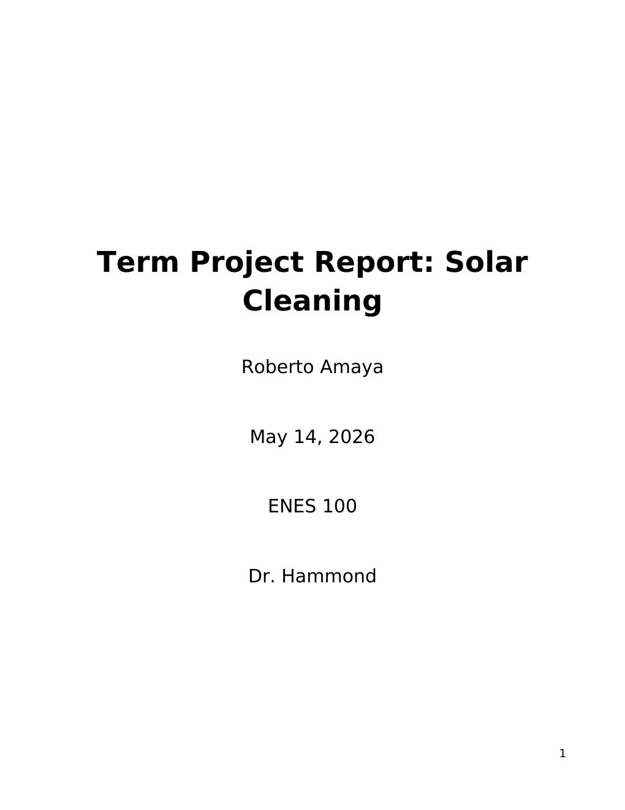

---

### Page 2 — Executive Summary & Table of Contents

The Solar Savior addresses energy efficiency losses caused by dust, debris, and pollutants on photovoltaic surfaces. The project integrates CREO Parametric for 3D mechanical modeling of a screw-drive railing system and Microsoft Excel (with VBA) for performance simulation and automation logic. Key findings confirm the system is technically feasible and outperforms manual cleaning methods.

---

### Page 3 — Table of Contents (cont.) & Lists of Tables/Figures

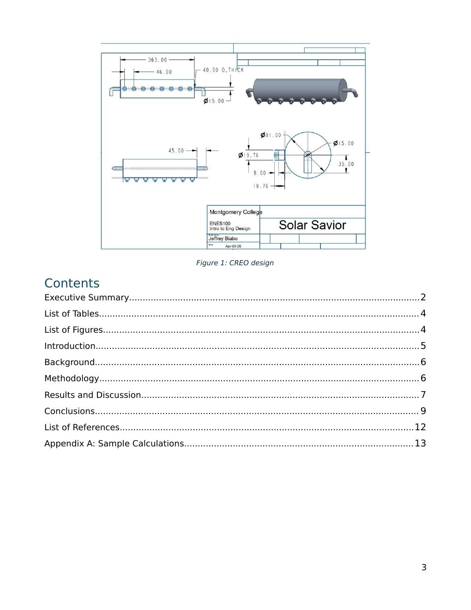

---

### Page 4 — Introduction

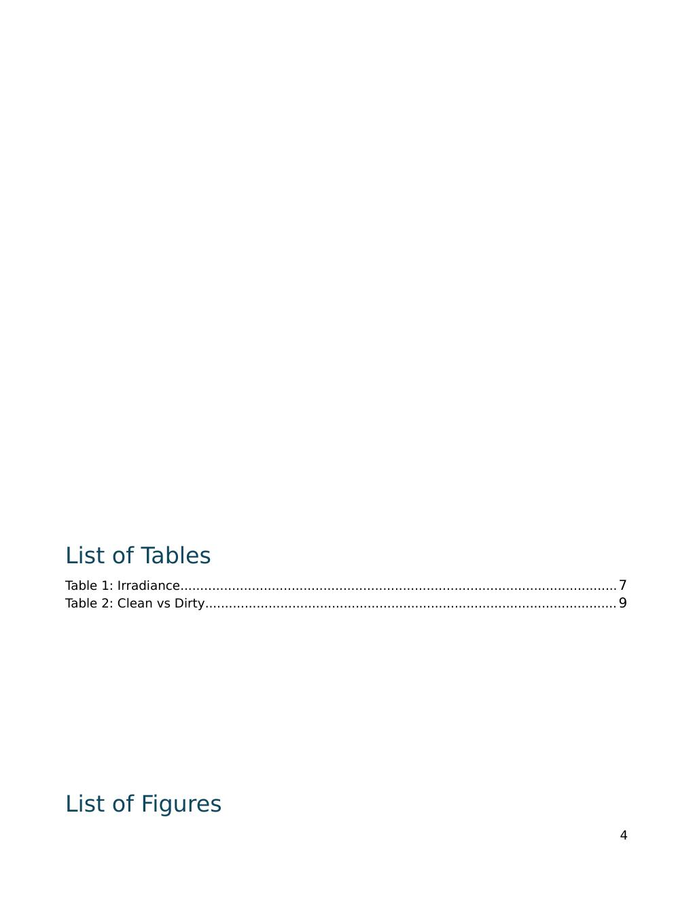

**1.1 Project Overview:** As the global shift toward renewable energy accelerates, solar panel efficiency depends heavily on surface clarity. Soiling can reduce output by 25–30% in high-debris areas. The Solar Savior was initiated to maximize ROI for solar installations through automated maintenance.

**1.2 Statement of Problem:** The primary problem is the lack of affordable, low-cost maintenance for small-to-medium solar arrays. Affected users include residential homeowners (safety risk on steep roofs), small-scale solar farms (no capital for industrial robots), and elderly or physically limited users.

**1.3 Statement of Need:** A cleaning system that is technically robust and economically viable. The Solar Savior fills this gap with a rail-mounted screw-drive mechanism that requires no human intervention on a roof.

**1.4 Limitations of Existing Solutions:** Manual hosing (water waste, inconsistency), safety risks (rooftop/ladder exposure), and sporadic cleaning schedules leading to extended efficiency losses.

---

### Page 5 — Background & Methodology

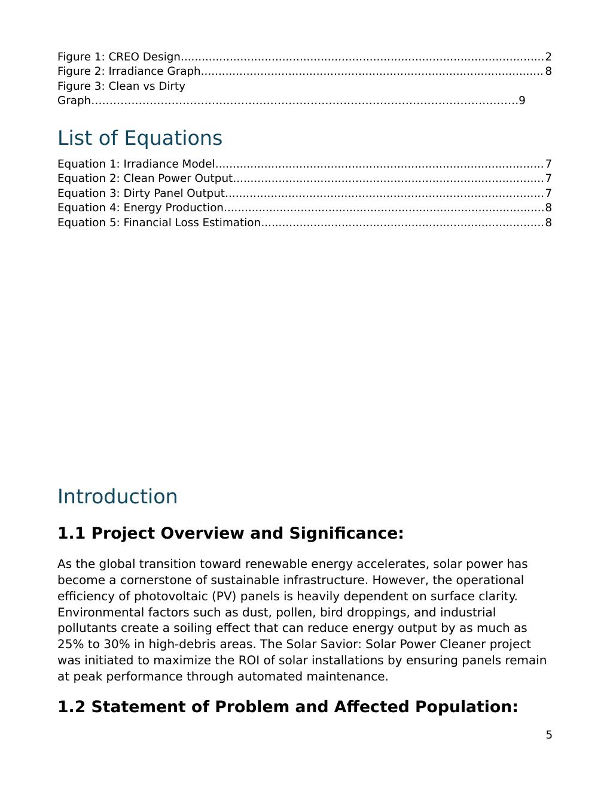

**Background:** Solar panels generate electricity when photons strike silicon cells. Physical barriers like dust create shading that reduces output and can cause permanent hot spots. Standard belt-driven cleaning systems suffer from moisture slippage; the screw drive mechanism was selected for its mechanical advantage and linear motion stability across varying installation angles.

**Methodology:** The design process integrated two tools — CREO Parametric for structural 3D modeling, and Microsoft Excel for performance simulation. Physical constraints (motor torque, rail load capacity, component weights) were cross-referenced against simulation data to verify feasibility.

---

### Page 6 — Simulation Equations

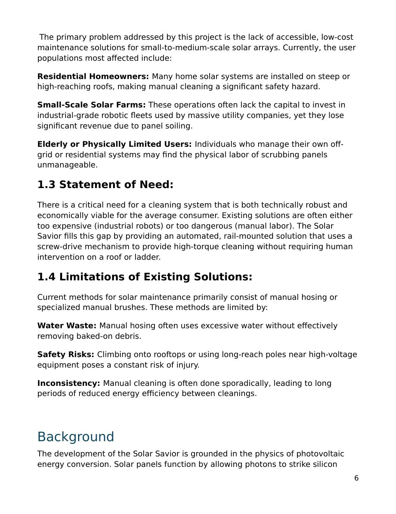

Five core equations power the Excel simulation:

1. **Irradiance Model:** `I(t) = 1000 · sin(π(t−6)/12)` — sinusoidal daylight curve
2. **Clean Power Output:** `P_clean = I × A × η`
3. **Dirty Panel Output:** `P_dirty = P_clean × (1 − D × L)`
4. **Energy Production:** `E = P × Δt`
5. **Financial Loss:** `C = (E_clean − E_dirty) × R`

Rain events and automated cleaning cycles are incorporated to simulate partial and full efficiency recovery over time.

---

### Page 7 — Results: Irradiance Data Table

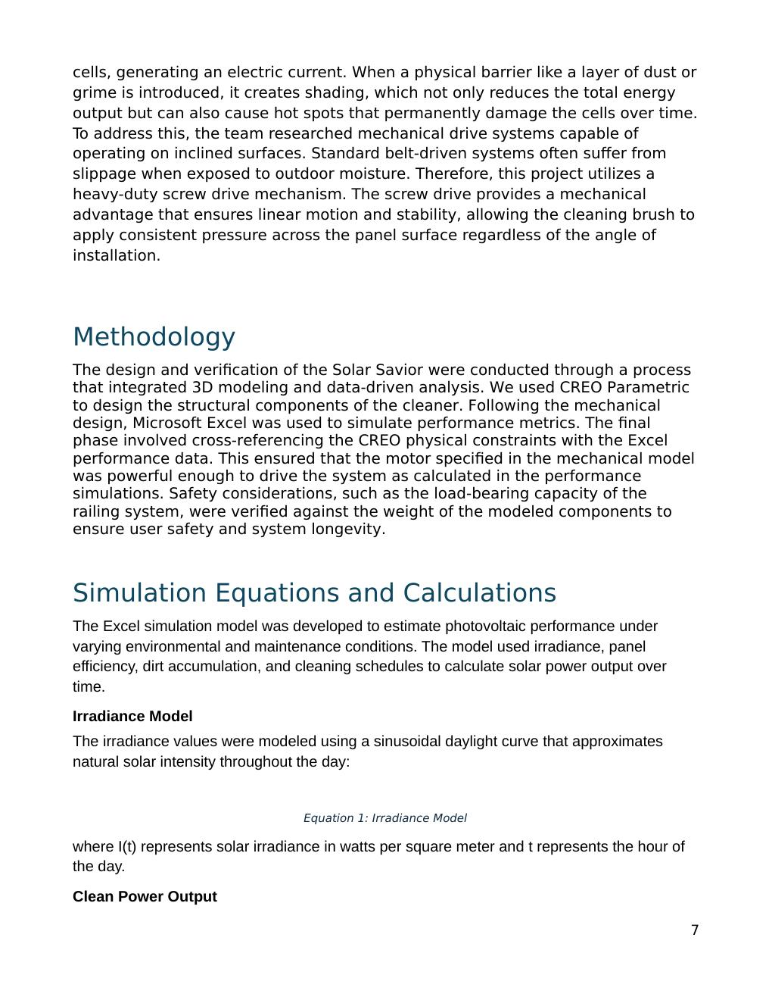

The irradiance table records W/m² values from 06:00 to 18:00 in 30-minute intervals. The morning phase (06:00–09:00) shows a steady climb from 0 W/m² to ~707 W/m². The peak solar window (10:00–12:00) reaches 1000 W/m² at solar noon.

---

### Page 8 — Results: Irradiance Graph & Clean vs. Dirty Data

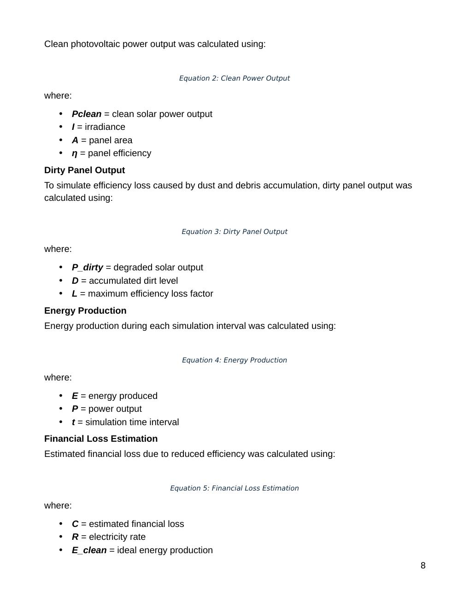

The clean vs. dirty power comparison table quantifies the efficiency gap at each time step. At peak irradiance (12:00), clean output is 320 W vs. 256 W dirty — a 20% reduction. Integrated over a full day, this loss compounds significantly across weeks and months of accumulated soiling.

---

### Page 9 — Results: Clean vs. Dirty Graph & Discussion

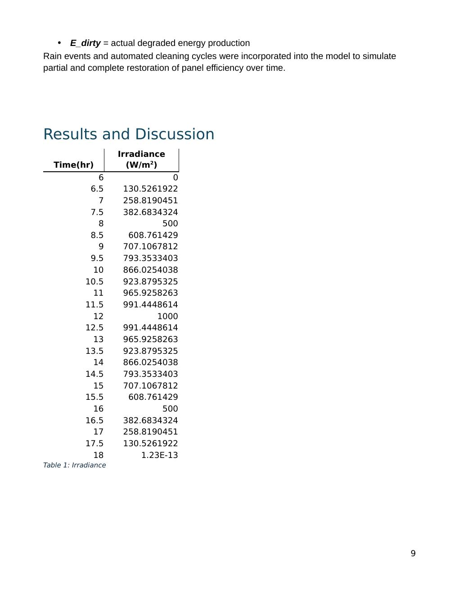

The data confirms the value of the Solar Savior's core design decision: scheduling cleaning cycles **before 09:00 AM** ensures panels are fully clean before the high-output window (10:00–14:00) begins. Cleaning during low-irradiance hours maximizes daily energy yield without disrupting peak-hour output.

---

### Page 10 — Conclusions

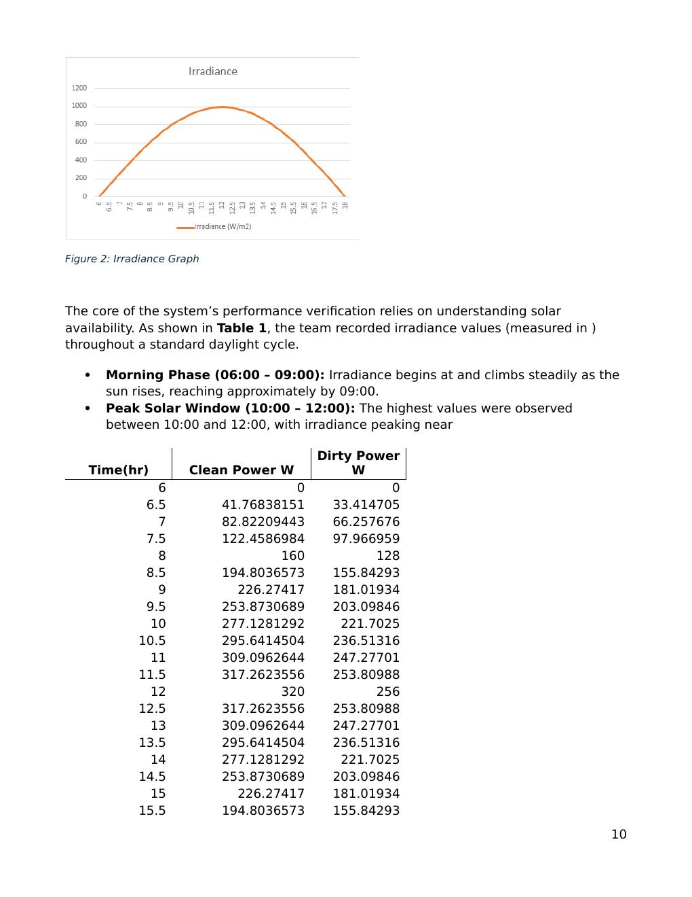

The Solar Savior successfully demonstrates a viable mechanical and data-driven solution to solar panel soiling. Key conclusions:

- A proactive early-morning cleaning schedule effectively mitigates peak-hour efficiency losses
- The screw drive rail system delivers the torque and stability required across diverse installation angles
- CREO modeling confirmed structural feasibility; Excel simulation verified performance projections
- The system is technically superior to manual cleaning and economically accessible to residential users

Future work: autonomous sensors, self-charging capability, and real-world data validation.

---

### Page 11 — References

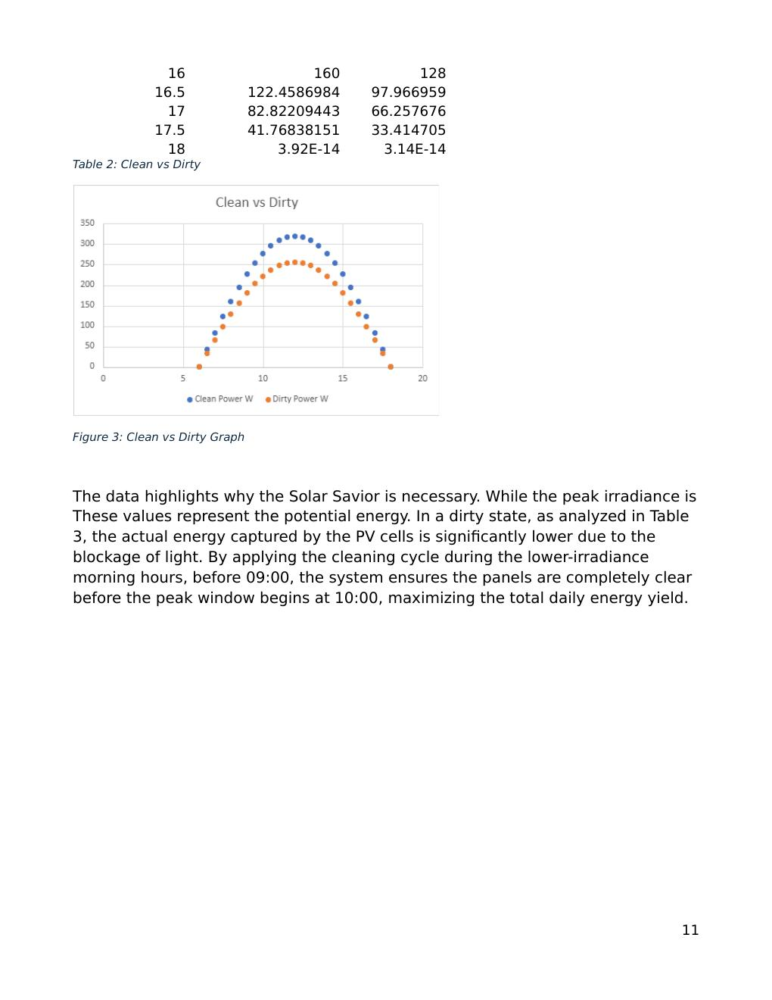

1. National Renewable Energy Laboratory (NREL) — [nrel.gov](https://www.nrel.gov)
2. MIT OpenCourseWare, Solar Energy (2.997) — [ocw.mit.edu](https://ocw.mit.edu)
3. PVeducation.org — [pveducation.org](https://www.pveducation.org)
4. Maghami et al. (2016). Power loss due to soiling on solar panels. *Renewable and Sustainable Energy Reviews*, 59, 1307–1316.
5. Sarver, Al-Qaraghuli & Kazmerski (2013). Impact of dust on solar energy. *Renewable and Sustainable Energy Reviews*, 22, 698–733.

---

### Page 12 — Appendix A: Sample Calculations (Part 1)

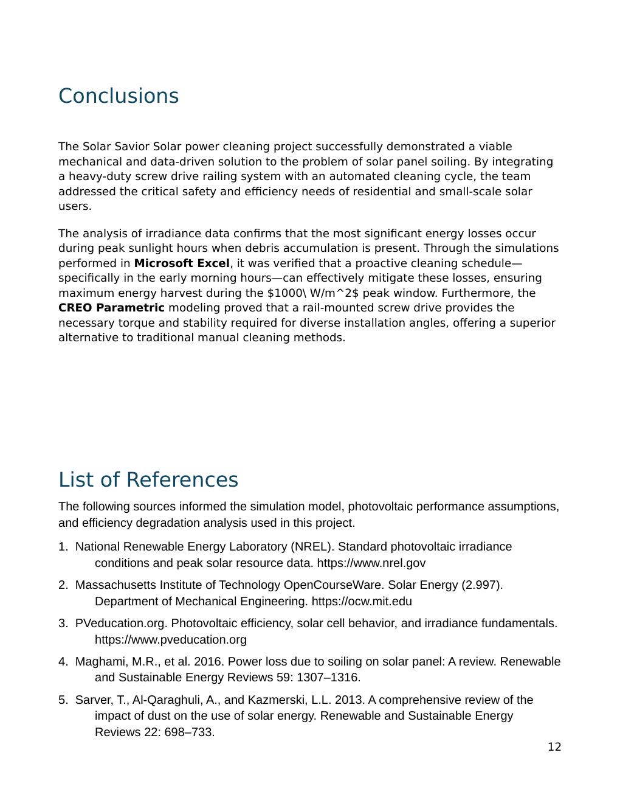

Worked examples for each of the five simulation equations using representative values:

- **Eq. 1 at t=10:** `I = 1000 × sin(60°) ≈ 866 W/m²`
- **Eq. 2:** `P_clean = 866 × 1.6 × 0.20 ≈ 277.1 W`
- **Eq. 3:** `P_dirty = 277.1 × (1 − 0.20) ≈ 221.7 W`
- **Eq. 4:** `E = 277.1 × 0.5 = 138.6 Wh`
- **Eq. 5:** `C = (138.6 − 110.9) × $0.00013 ≈ $0.0036 per interval at peak`

---

### Page 13 — Appendix A: Sample Calculations (Part 2)

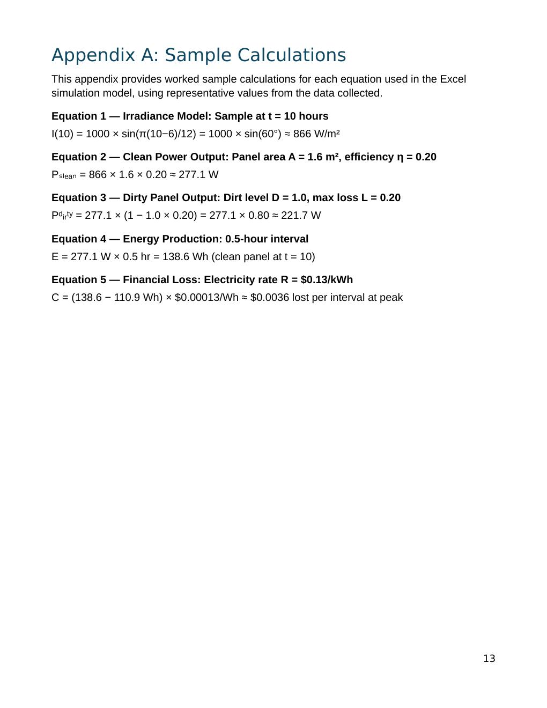

---

*Presentation slides: [`presentation/PRESENTATION.md`](../presentation/PRESENTATION.md) | Simulation deep-dive: [`simulation/SIMULATION_DOCS.md`](../simulation/SIMULATION_DOCS.md)*
