# Solar Savior — Project Presentation

**ENES 100 | Roberto Amaya | May 2026**

All 12 slides from the project pitch deck, embedded inline.

---

### Slide 1 — Title

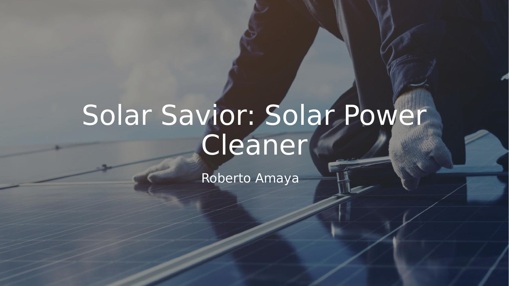

---

### Slide 2 — The Issue

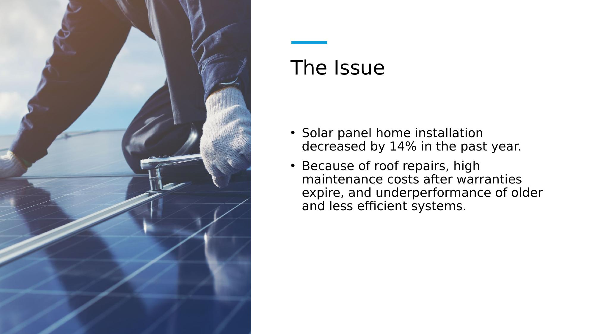

Solar panel home installation decreased by 14% in the past year — driven by roof repair costs, high maintenance after warranties expire, and underperformance of older systems. Soiling is a major compounding factor: panels that aren't cleaned regularly degrade further in effective output.

---

### Slide 3 — Statement of Need

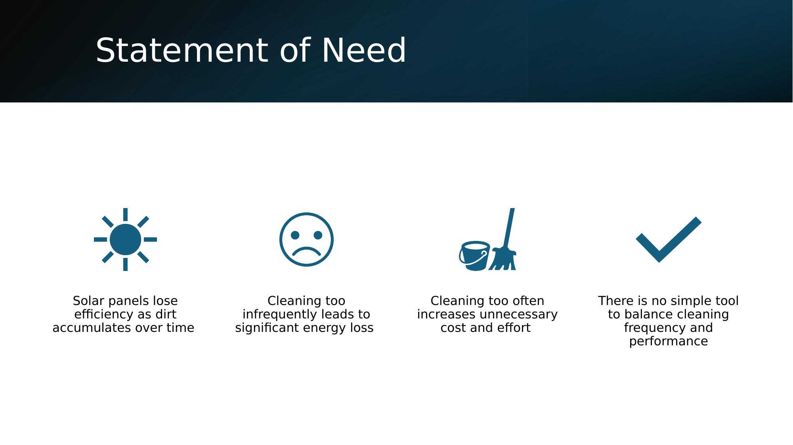

There is a critical gap in the market for affordable, safe, and automated cleaning solutions for residential solar users. Industrial cleaning robots serve utility-scale farms; nothing comparable exists for homeowners.

---

### Slide 4 — Purpose

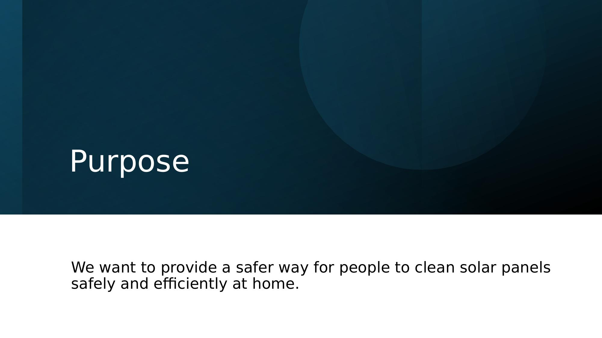

The goal: provide a safer way for people to clean solar panels efficiently at home — without climbing onto roofs, using long-reach tools near high-voltage equipment, or hiring expensive service visits.

---

### Slide 5 — Audience

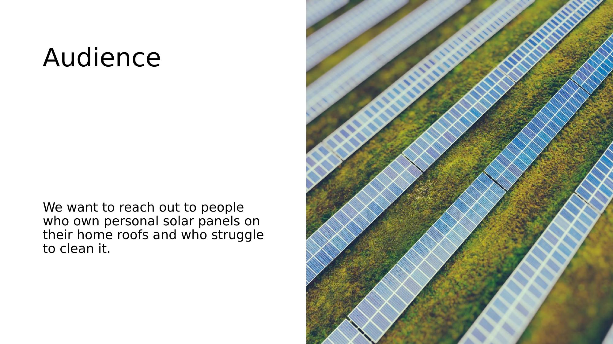

Primary target users: homeowners with rooftop solar panels who struggle to maintain them safely. Secondary: elderly or physically limited users managing off-grid or residential systems, and small-scale solar farm operators without capital for industrial robotic solutions.

---

### Slide 6 — Current Solutions & Limitations

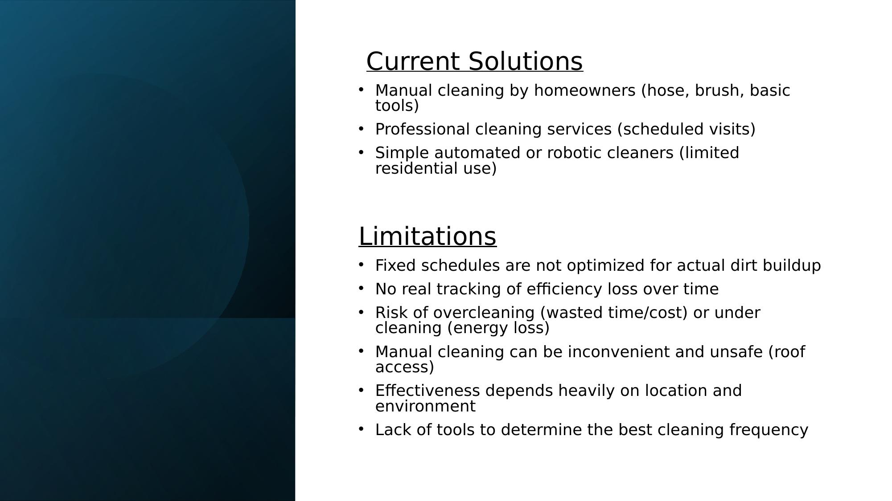

**Existing approaches:**
- Manual cleaning (hose, brush) — water waste, inconsistent, safety hazard
- Professional cleaning services — fixed schedules not tied to actual dirt levels
- Basic automated cleaners — limited residential availability, no performance feedback

**The core problem with all of them:** no real-time tracking of efficiency loss, no data-driven cleaning schedule, and no way to quantify what you're losing by not cleaning.

---

### Slide 7 — Why Our Design?

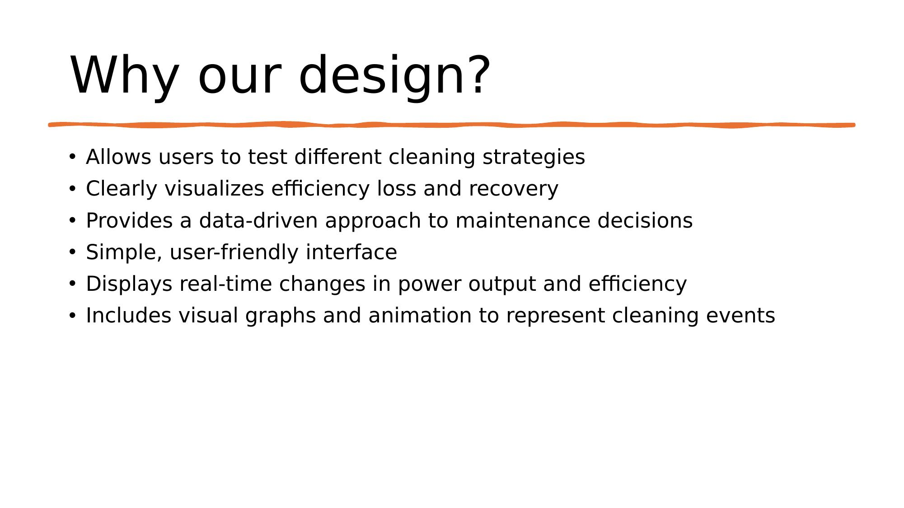

The Solar Savior addresses the data gap directly:
- Users can test different cleaning strategies and see the simulated impact
- Efficiency loss and recovery are clearly visualized over time
- The system provides a data-driven approach to maintenance decisions
- Real-time changes in power output are displayed as the simulation runs
- Cleaning events are represented with visual graphs and animation in the Excel model

---

### Slide 8 — Mechanical Model

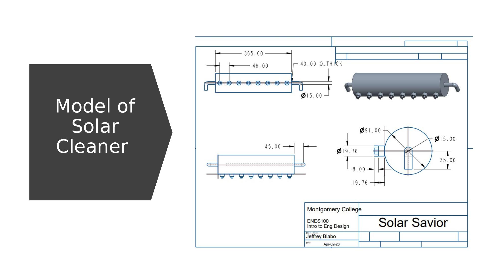

The 3D model designed in CREO Parametric shows the screw-drive rail assembly. The cleaning carriage travels along a 365 mm threaded rod, driven by a motor mounted at one end. The screw drive was chosen over belt-based alternatives for its resistance to slippage on inclined surfaces and its ability to deliver consistent torque regardless of panel angle.

See [`docs/TECHNICAL_NOTES.md`](../docs/TECHNICAL_NOTES.md) for a full breakdown of the mechanical design decisions and dimension callouts from the CREO drawing.

---

### Slide 9 — Data

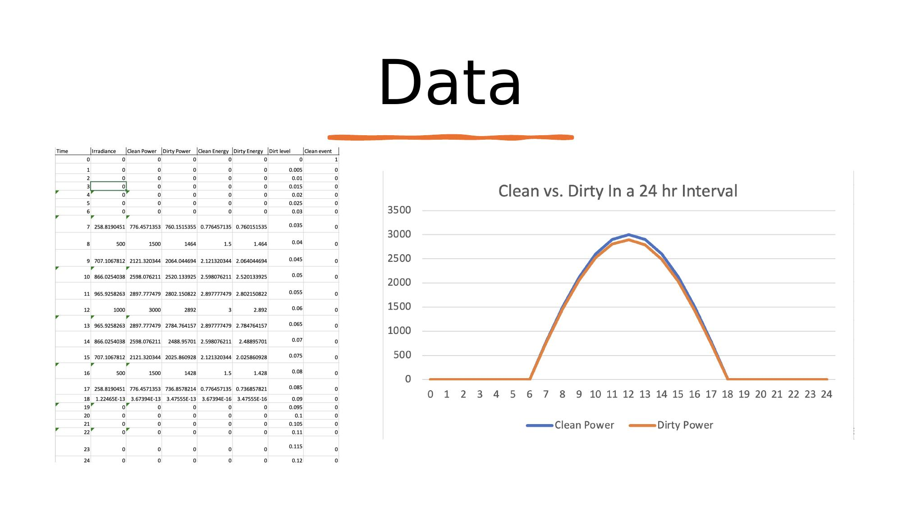

The simulation outputs time-series data for irradiance, clean power, dirty power, and accumulated dirt level across the configured simulation window. Data is written to the `Data` sheet in the Excel workbook row by row as the VBA macro runs.

See [`simulation/SIMULATION_DOCS.md`](../simulation/SIMULATION_DOCS.md) for a full breakdown of each data column and what it represents.

---

### Slide 10 — Excel Demonstration

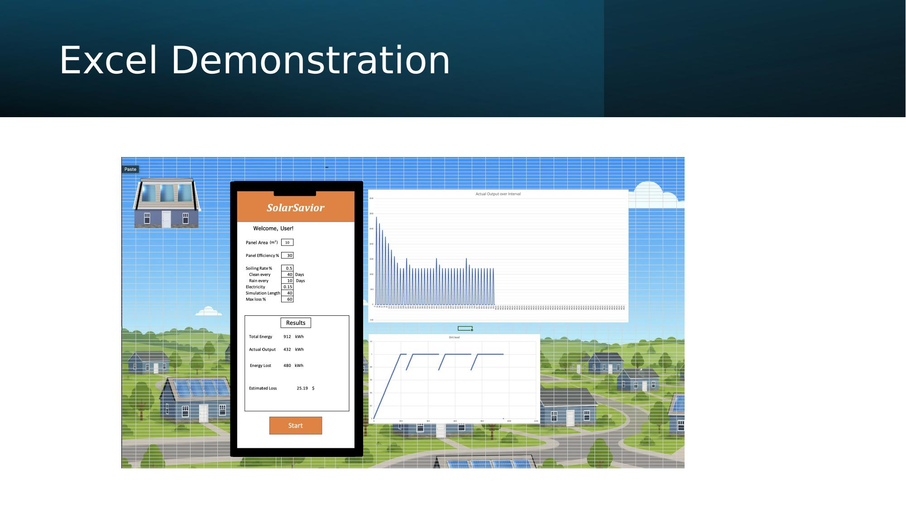

The Excel model (`simulation/solar_panel_simulation.xlsx`) features a live dashboard where users adjust panel parameters and run the simulation with one button click. Charts update automatically. Two scenario tabs allow side-by-side comparison of different cleaning schedules.

---

### Slide 11 — Animation Demonstrated

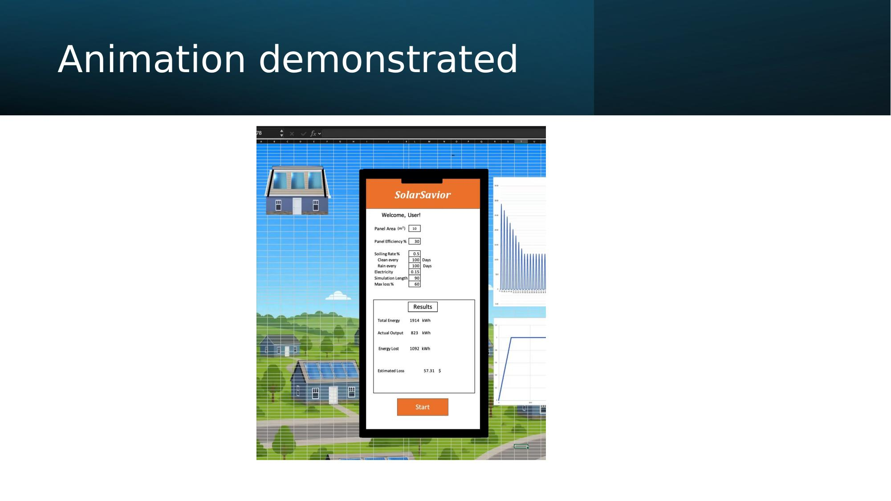

The VBA automation layer includes an animation mode that steps through the simulation day by day, visually showing the dirt level rising, cleaning events resetting the curve, and rain events partially recovering efficiency. This was built entirely within Excel using timed cell updates and chart refresh calls — no external animation tools.

---

### Slide 12 — Future Work & Challenges

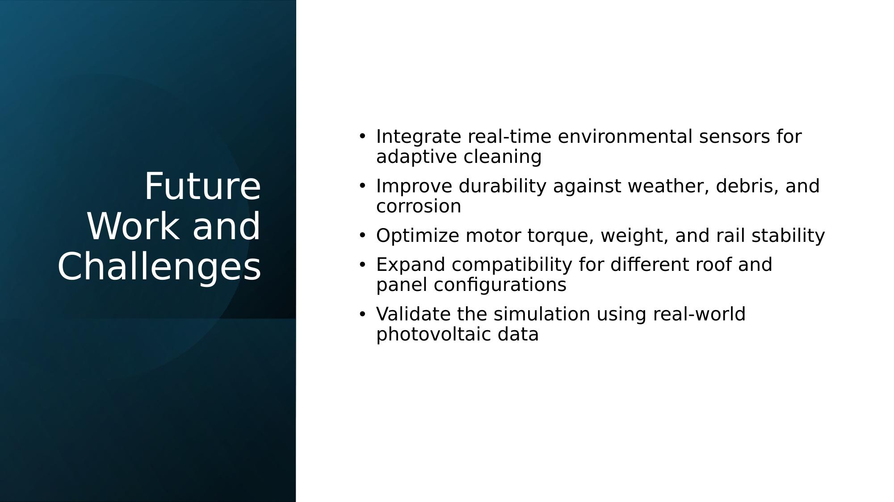

**Next steps for the Solar Savior:**
- Integrate real-time environmental sensors for adaptive, demand-based cleaning
- Improve mechanical durability against weather, debris, and corrosion
- Optimize motor torque-to-weight ratio and rail stability under load
- Expand mounting compatibility for different roof pitches and panel frame profiles
- Validate the Excel simulation model against measured real-world photovoltaic sensor data

---

*Full technical report: [`docs/Solar_Savior_Report.docx`](Solar_Savior_Report.docx) | Full report page-by-page: [`docs/REPORT.md`](../docs/REPORT.md)*
